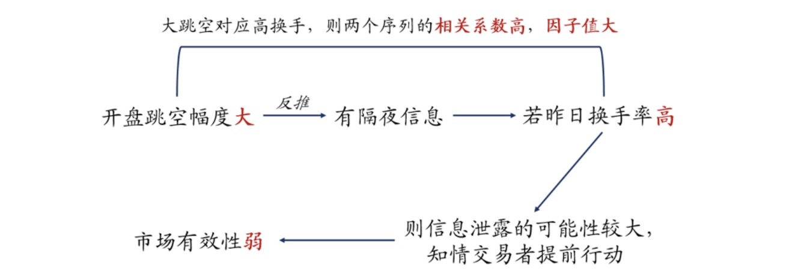

# 如何将隔夜涨跌变为有效的选股因子？——基于对知情交易者信息优势的刻画

## **隔夜涨跌幅**绝对值

反映了股价在晚上或在交易后的信息披露等因素下的变化。若市场存在知情交易者，且他们已经获得了某些尚未广泛公开的消息，那么在公开信息之前，股价的变化往往会较大，表现为隔夜涨跌幅较大。

## 换手率

表示的是市场中股票的流动性和活跃程度。较高的换手率通常意味着市场上有大量的买卖交易发生，这可能是由知情交易者带动的，因为他们的交易量较大，能够推动价格波动。

如果隔夜涨跌幅绝对值较大且换手率较高，可能表明市场中存在知情交易者，他们根据信息做出了交易决策，并推动了股价的波动。

## 市场有效性理论

所有已知的信息在市场价格中都会即时且完全地反映出来。如果市场是完全有效的，那么信息应该被迅速吸收，股价波动应该反映出所有的公开信息，而没有显著的异常波动。

如果**隔夜涨跌幅**与**换手率**之间有较高的相关性，可能表明市场反应迅速且有效，知情交易者能够迅速根据信息进行交易并影响价格。相反，如果二者的相关性较低，则可能表明市场对信息的反应不及时，市场存在滞后反应，这意味着市场有效性较弱，可能存在信息不对称或市场效率低下的情况。

- ### 传统隔夜涨跌幅因子：今开/昨收 - 1
- ### 隔夜跳空因子：隔夜涨跌幅加绝对值
- ### MIF：隔夜涨跌幅绝对值与昨日换手率的相关系数，该因子衡量了知情交易者信息优势的大小，也反映了市场有效性的强弱, 通过捕捉股价和交易量的动态，间接地反映了市场的有效性和知情交易者的信息优势。
- ### 超额MIF: 超额涨跌 or 超额换手 or 超额涨跌+超额换手

隔夜跳空幅度较大的股票，可能存在短期交易过热的现象，通常股票短期交易过热会导致未来表现就相对较差（即IC为负），对于爱玩妖股的我深有体会。。

对于传统反转因子，统计每月累计超额涨跌幅（相对于所有股票的等权均值），将股票分为上涨、下跌两组，统计下个月组内股票的平均超额收益，再计算时序上的均值，发现过去上涨的股票，下个月的反转力量更强，反应为反转因子多空收益的不对称。

原因：非理性交易行为造成股价短期反应过度，追涨和杀跌的力量不对称，其一是a股市场卖空的限制，其二是散户涨点就卖，跌了死拿的韭菜行为

所以无论上涨还是下跌，只要知情交易者有信息优势、能够提前行动，都会对股票未来收益造成负面影响，故MIF的IC为负
